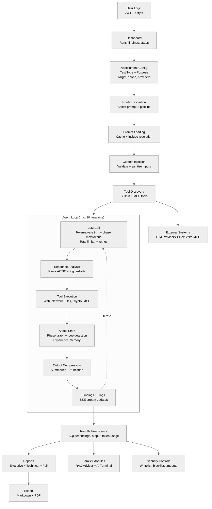

# RedBox - Report Diagram (Mermaid)

## How to use
1. Go to https://mermaid.live
2. Copy the code below
3. Paste it in the editor
4. Export PNG or SVG for your report

---

```mermaid
%%{init: {'theme': 'neutral', 'themeVariables': { 'fontSize': '12px', 'fontFamily': 'monospace'}}}%%
flowchart TD
    A["User Login\nJWT + bcrypt"] --> B["Dashboard\nRuns, findings, status"]
    B --> C["Assessment Config\nTest Type + Purpose\nTarget, scope, providers"]

    C --> D["Route Resolution\nSelect prompt + pipeline"]
    D --> E["Prompt Loading\nCache + include resolution"]
    E --> F["Context Injection\nValidate + sanitize inputs"]
    F --> G["Tool Discovery\nBuilt-in + MCP tools"]

    G --> LOOP
    subgraph LOOP ["Agent Loop (max 30 iterations)"]
        direction TB
        H["LLM Call\nToken-aware trim + phase maxTokens\nRate limiter + retries"]
        H --> I["Response Analysis\nParse ACTION + guardrails"]
        I --> J["Tool Execution\nWeb, Network, Files, Crypto, MCP"]
        J --> K["Attack State\nPhase graph + loop detection\nExperience memory"]
        K --> L["Output Compression\nSummaries + truncation"]
        L --> M["Findings + Flags\nSSE stream updates"]
        M -.->|iterate| H
    end

    M --> N["Results Persistence\nSQLite: findings, output, token usage"]
    N --> O["Reports\nExecutive + Technical + Full"]
    O --> P["Export\nMarkdown + PDF"]

    N --> Q["Parallel Modules\nRAG Advisor + AI Terminal"]
    G --> R["External Systems\nLLM Providers + HexStrike MCP"]
    N --> S["Security Controls\nWhitelist, blocklist, timeouts"]
```
